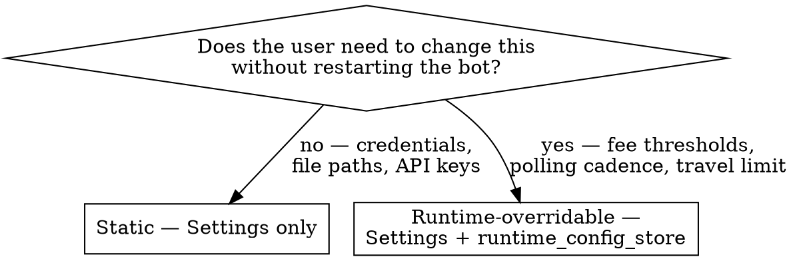

# Add a Config Field

## Overview

Every new env var must hit four places. Pydantic rejects unknown env keys at startup, so missing step 1 will crash the bot on the next deploy. Missing step 4 makes the field undiscoverable.

The decision that matters: **is this overridable at runtime via the Telegram bot, or is `.env` the only source?** Get this wrong and either users can't change it without a redeploy, or you have a runtime override that the scheduler never reads.

## Decision: Static vs runtime-overridable



The three current runtime-overridable fields are `min_fee`, `max_travel_minutes`, and `poll_minutes`. Everything else is static.

## Four-File Pattern

### 1. `organist_bot/config.py` — declare the field

```python
class Settings(BaseSettings):
    ...
    my_new_field: str = ""  # use the right type; provide a default unless required
```

**Required vs optional:** fields without defaults (like `email_sender`) raise at import time if unset. Use this only when the bot truly cannot run without the value. For everything else, give a default — `""`, `0`, `False`, or a sensible value — and let the consuming code guard on truthiness.

**Naming:** lowercase snake_case in Python. Pydantic auto-maps to upper SNAKE_CASE env var. So `my_new_field` reads from `MY_NEW_FIELD` in `.env`.

### 2. `.env.example` (if it exists) or note in CLAUDE.md — document the field

Add the variable with a short comment explaining what it does and any default behavior:

```
# Short description of what this controls
MY_NEW_FIELD=
```

### 3. (If runtime-overridable) Add to `runtime_config_store` consumers in `main.py`

The store itself is generic (`runtime_config.get(key, default)`), so no change to `runtime_config_store.py` is needed. But the scheduler in `main.py` must read via the store, falling back to the Settings value:

```python
# In main.py wherever the value is used:
value = runtime_config.get("my_new_field", settings.my_new_field)
```

Then add a tool to `integrations/unified_agent.py` (or extend `manage_config`) so the Telegram bot can write it via `runtime_config.set("my_new_field", value)`.

### 4. `CLAUDE.md` — update the config table

Add the field name to the relevant section in the `## Configuration` block (Scraper, Postcode, Calendar, etc.) so future Claude sessions can find it. If it's runtime-overridable, also add it to the line that lists `runtime_config_store` overrides.

## Common Mistakes

| Mistake | Consequence |
|---|---|
| Adding `MY_FIELD=` to `.env` without declaring it on `Settings` | Pydantic raises `ValidationError` at import: `Extra inputs are not permitted` |
| Reading `os.getenv("MY_FIELD")` instead of `settings.my_field` | Bypasses validation, type coercion, and the `.env` file path config |
| Making a field runtime-overridable without `runtime_config.get(...)` in the consumer | The Telegram tool writes the override, but the scheduler ignores it until next restart |
| Marking a field as required (no default) when only some deploy modes need it | Tests crash because they don't set the var (see `EMAIL_SENDER=ci@test.com ... pytest` workaround) |
| Forgetting CLAUDE.md update | Future sessions don't know the field exists and may add a duplicate |

## Live test

After adding the field, verify it loads cleanly:

```bash
EMAIL_SENDER=ci@test.com EMAIL_PASSWORD=x CC_EMAIL=ci@test.com \
  python -c "from organist_bot.config import settings; print(settings.my_new_field)"
```

If it prints the default (or the value from `.env`), you're done. If it raises `ValidationError`, the field name doesn't match the env var.
