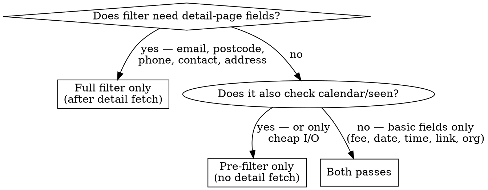

# Add a Gig Filter

## Overview

Every filter touches four files in a specific pattern. The most critical decision is **which pass** the filter belongs in — getting this wrong either wastes HTTP requests or silently skips filtering.

## The Critical Decision: Which Pass?



**Basic fields** (available pre-filter): `header`, `organisation`, `locality`, `date`, `time`, `fee`, `link`

**Detail fields** (require a detail-page HTTP fetch): `email`, `postcode`, `phone`, `contact`, `address`, `musical_requirements`

Adding a filter to the pre-filter pass avoids a detail-page HTTP fetch for every gig it rejects — on a high-volume poll this is significant. Filters that only need basic fields should always be in the pre-filter.

## Four-File Pattern

### 1. `organist_bot/filters.py` — implement the filter

```python
class MyFilter(GigFilter):
    def __init__(self, ...):
        ...

    def is_valid(self, gig: Gig) -> bool:
        # Return True to keep the gig, False to reject it
        ...

    def __repr__(self) -> str:
        return f"MyFilter(...)"  # used in filter_breakdown log
```

`__repr__` is used as the key in the `filter_breakdown` JSON logged by `GigFilterChain`. Make it descriptive enough to be recognisable in logs.

### 2. `organist_bot/config.py` — add a toggle

```python
enable_my_filter: bool = True
```

All filter toggles default to `True`. Users disable them in `.env`.

### 3. `main.py` — register in the correct pass(es)

**Pre-filter block** (inside `# ── Phase 1: Scrape` section, ~line 87):
```python
if settings.enable_my_filter:
    pre_filter.add(MyFilter(...))
else:
    logger.info("MyFilter disabled")
```

**Full filter block** (inside `# ── Phase 2: Filter` section, ~line 165):
```python
if settings.enable_my_filter:
    filter_chain.add(MyFilter(...))
else:
    logger.info("MyFilter disabled")
```

If the filter needs config params (e.g. an API key), add a guard:
```python
if settings.enable_my_filter and settings.my_required_key:
    filter_chain.add(MyFilter(settings.my_required_key))
elif not settings.enable_my_filter:
    logger.info("MyFilter disabled")
else:
    logger.info("MyFilter disabled — MY_REQUIRED_KEY not set")
```

### 4. `tests/test_filters.py` — write the test

Follow the existing pattern: construct a minimal `Gig`, assert `is_valid` returns the expected value.

```python
def test_my_filter_rejects_X():
    f = MyFilter(...)
    gig = Gig(header="Test", organisation="St Mary's", locality="London",
               date="15 June 2026", time="10:30am", fee="£150", link="http://example.com")
    assert not f.is_valid(gig)

def test_my_filter_passes_Y():
    f = MyFilter(...)
    gig = Gig(...)
    assert f.is_valid(gig)
```

## Common Mistakes

| Mistake | Consequence |
|---|---|
| Adding a basic-field filter to full filter only | Detail-page fetch happens before the filter can reject — wasted HTTP requests |
| Adding a detail-field filter to pre-filter | `Gig` has `None` for detail fields at pre-filter time — filter silently passes everything |
| Forgetting the `else: logger.info(...)` branch | No log entry when filter is disabled — hard to diagnose in production |
| Omitting `__repr__` | `filter_breakdown` log shows class object address instead of readable name |
