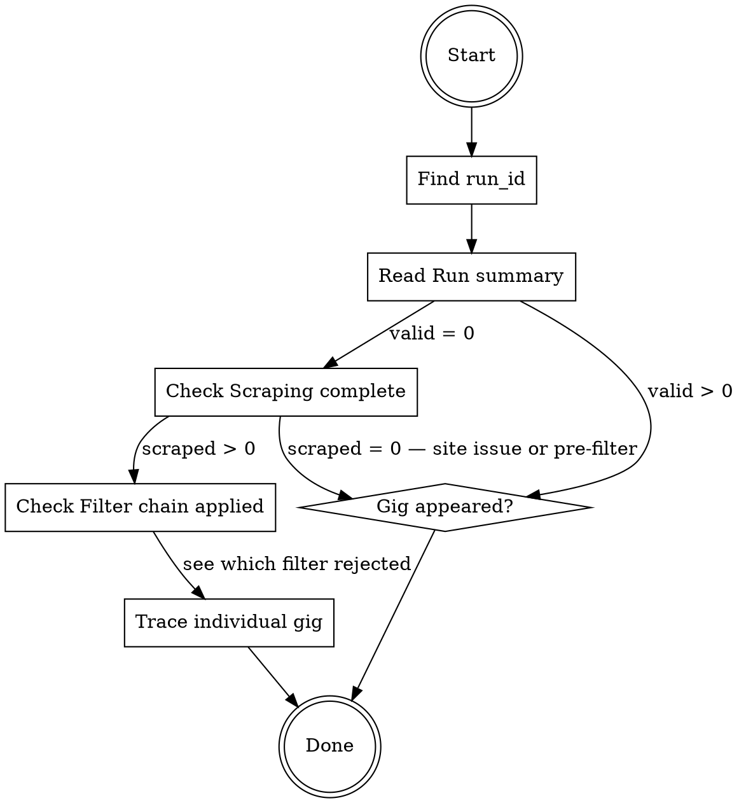

# Diagnose a Pipeline Run

## Overview

Each scheduler tick produces a set of structured log entries with a shared `run_id`. The diagnosis path is: find the run → read the summary → check filter breakdowns → trace individual gigs.

## Log Files

```
gigs.log        # current log (rotated)
gigs.log.1      # previous rotation
gigs.log.2, gigs.log.2 2, gigs.log.2 3, gigs.log.3  # older rotations
```

Logs are JSON-structured. Key fields: `timestamp`, `run_id`, `level`, `logger`, `message`, `details` (JSON object with run-specific data).

## Diagnosis Flow



## Key Log Messages and Their Fields

**`Run summary`** — one per tick, always present
```json
{ "run_id": "a1b2c3d4", "scraped": 5, "valid": 0, "notified": 0, "gig_errors": 0, "elapsed_ms": 4200 }
```
`scraped = 0` → nothing passed pre-filter or site returned nothing. `valid = 0` but `scraped > 0` → full filter rejected everything.

**`Scraping complete`** — one per tick
```json
{ "listed": 12, "pre_filter_passed": 3, "scraped": 3, "gig_errors": 0, "elapsed_ms": 2100 }
```
`listed` = total gigs on the page. `pre_filter_passed` = survived cheap pre-filter. `scraped` = detail pages fetched. If `listed > 0` and `pre_filter_passed = 0`, the pre-filter is rejecting everything before detail fetches.

**`Filter chain applied`** — emitted twice per tick (once for pre-filter, once for full filter)
```json
{
  "filter_breakdown": {
    "FeeFilter(min_fee=100)": 8,
    "SeenFilter": 1,
    "SundayTimeFilter": 0
  },
  "total_in": 12,
  "passed": 3
}
```
Each key is the filter's `__repr__`, value is the rejection count for that filter. Filters are evaluated in order — a gig rejected by the first filter is not counted by subsequent filters.

**`Gig passed all filters`** — one per gig that survives, includes `header`, `date`, `fee`, `organisation`, `postcode`, `contact_email`, `link`

**`Telegram: rejected unauthorised message`** — someone messaged the bot from an unknown `chat_id`. Not a pipeline issue.

## Common Diagnoses

| Symptom | Where to look | Likely cause |
|---|---|---|
| `listed = 0` | `Scraping complete` | Site unreachable or HTML structure changed |
| `pre_filter_passed = 0` | `Filter chain applied` (pre-filter) | `FeeFilter`, `SeenFilter`, or `CalendarFilter` rejecting everything |
| `scraped > 0` but `valid = 0` | `Filter chain applied` (full filter) | `BlacklistFilter` or `PostcodeFilter` rejecting after detail fetch |
| Specific gig missing | Search log for its URL or org name | Rejected gig — check which filter's count increased on that run |
| `gig_errors > 0` | Look for `Failed to build gig` entries | Scraper parsing error on a specific gig's detail page |

## Finding a Specific Gig

If you know a gig's URL or organisation name, search logs for it:
```bash
grep "organisation-name" gigs.log
grep "organistsonline.org/specific-path" gigs.log
```

If the gig doesn't appear in any log entry, it was rejected in the pre-filter before a detail fetch — only `filter_breakdown` counts are available, not per-gig rejection reasons.

## Filter Toggle Quick Check

If a filter is disabled, `main.py` logs `"X disabled"` at INFO level at the start of each run. If a filter should be active but isn't (e.g. `CalendarFilter` needs `GOOGLE_CALENDAR_ID` set), look for `"CalendarFilter disabled — ... not set"`.
